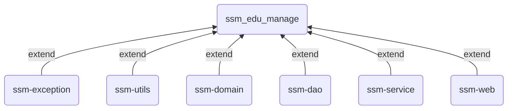
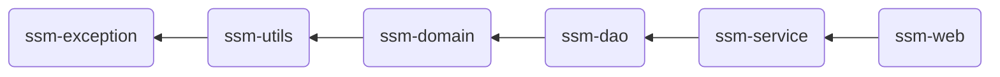

# ssm-edu-manager

## :triangular_ruler: Backend

This is an Course Management system for online education platforms

Implemented with SSM (Spring + SpringMVC + MyBatis)

**Project Structure：**

Seperate Modules extend their parent project, and modules dependent hierarchically

**modeules extendency：**

**modules dependency：**

ssm-web indirectly depends on all modules

## :straight_ruler: Frontend

**technique selection：**

| frontend technique | describe                                                     |
| ------------------ | ------------------------------------------------------------ |
| Vue.js             | An open-source model–view–viewmodel front end JavaScript framework for building user interfaces and single-page applications |
| Element UI         | A Vue 2.0 based component library for developers, designers and product managers，convenient for programmers to quickly layout and build pages |
| node.js            | A JavaScript runtime environment that runs on a JavaScript Engine and executes JavaScript code outside a web browser |
| axios              | a promise-based HTTP Client, encapsulates ajax               |

## :hammer_and_wrench: Dev Environment

- Tools
  - IntelliJ IDEA - 2021.1.3
  - VS Code
  - Navicat
  - Apifox
- environment
  - JDK - 11
  - Maven - 3.6.3
  - MySQL - 5.7.24
  - Tomcat - 8.5.78
  - Node.js - 12.18.1 x64
  - Vue-cli - 5.0.6

## :bell: Feature

- :man_factory_worker: user management
- :books: course & course content management
- :meat_on_bone: advertisement management
- :no_entry_sign: user permission management
- :hammer_and_pick: more freature under developement
